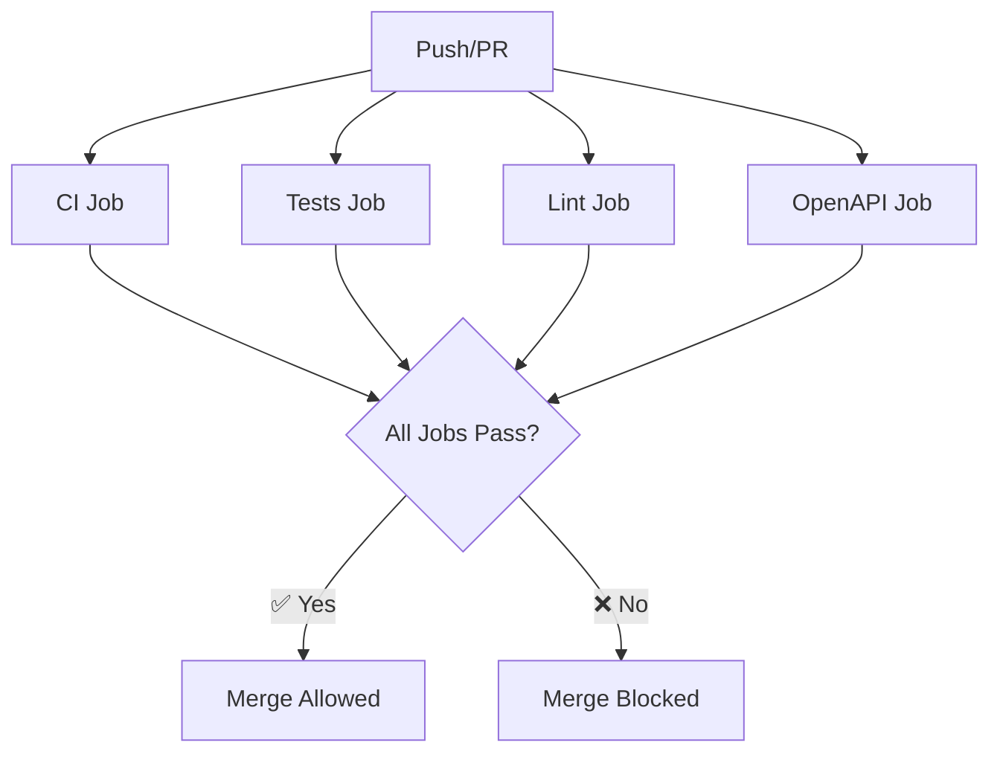

# GitHub Repository Setup Guide

## 🔧 Files Created

✅ **`.github/workflows/ci.yml`** - Complete CI pipeline with 4 jobs
✅ **`.env.example`** - Environment template for CI

## 🛡️ Branch Protection Rules Setup

### Step 1: Navigate to Branch Protection Settings

1. Go to your GitHub repository
2. Click **Settings** tab
3. Click **Branches** in the left sidebar
4. Click **Add rule** or **Add branch protection rule**

### Step 2: Configure Protection for `main` branch

**Branch name pattern:** `main`

**Protection Settings:**
- ✅ **Require a pull request before merging**
  - ✅ Require approvals: `1`
  - ✅ Dismiss stale PR approvals when new commits are pushed
  - ✅ Require review from code owners (if you have CODEOWNERS file)

- ✅ **Require status checks to pass before merging**
  - ✅ Require branches to be up to date before merging
  - **Required status checks:**
    - `CI`
    - `Tests` 
    - `Lint`
    - `OpenAPI`

- ✅ **Require conversation resolution before merging**
- ✅ **Restrict pushes that create public-facing content** (optional)

### Step 3: Configure Protection for `staging` branch

**Branch name pattern:** `staging`

**Protection Settings:**
- ✅ **Require a pull request before merging**
  - ✅ Require approvals: `1`

- ✅ **Require status checks to pass before merging**
  - ✅ Require branches to be up to date before merging
  - **Required status checks:**
    - `CI`
    - `Tests`
    - `Lint` 
    - `OpenAPI`

## 🚀 CI Pipeline Jobs

### 1. **CI Job**
- ✅ Builds and starts all services
- ✅ Seeds LocalStack (S3 + SQS)
- ✅ Runs health checks
- ✅ Executes basic tests

### 2. **Tests Job**
- ✅ Comprehensive test suite
- ✅ Detailed test output
- ✅ Verbose reporting

### 3. **Lint Job**
- ✅ Python syntax validation
- ✅ Code quality checks
- ✅ Import validation

### 4. **OpenAPI Job**
- ✅ Generates OpenAPI specification
- ✅ Validates API schema
- ✅ Tests API endpoints
- ✅ Ensures API documentation is current

## 📋 Workflow Triggers

- **Push** to `main` or `staging` branches
- **Pull Request** targeting `main` or `staging` branches

## 🔧 Local Testing

Test the CI workflow locally:

```bash
# Copy environment template
cp .env.example .env

# Run the same commands as CI
docker compose up --build -d
docker compose exec -T -e AWS_REGION=us-east-1 -e AWS_ENDPOINT_URL=http://localstack:4566 api python -m api.scripts.init_localstack
curl -sSf http://localhost:8080/__health
docker compose exec -T api pytest -q

# Cleanup
docker compose down -v
```

## ⚠️ Important Notes

1. **First Push**: The status checks won't appear until you push the CI workflow to your repository
2. **Status Check Names**: Must match exactly: `CI`, `Tests`, `Lint`, `OpenAPI`
3. **Branch Creation**: Create `staging` branch if it doesn't exist
4. **Environment Variables**: CI uses `.env.example` - ensure it has all required variables

## 🎯 Expected CI Flow



## 🚦 Status Check Requirements

All 4 jobs must pass for merges to be allowed:
- ✅ **CI** - Core functionality works
- ✅ **Tests** - All tests pass
- ✅ **Lint** - Code quality standards met
- ✅ **OpenAPI** - API documentation valid

This ensures high code quality and prevents breaking changes from reaching protected branches.
